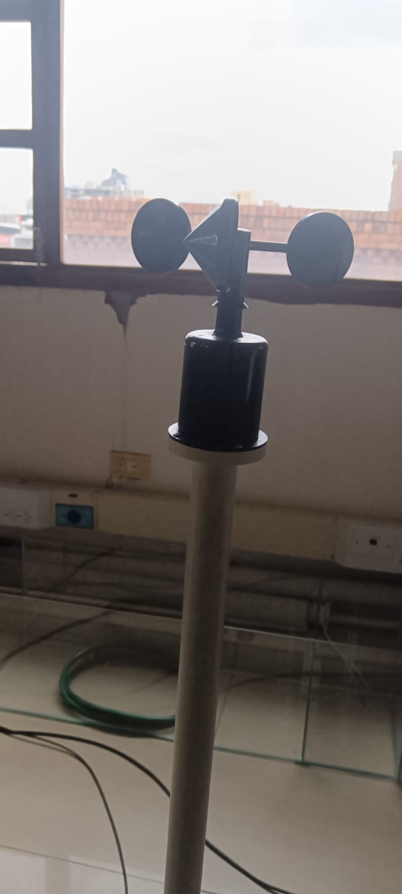
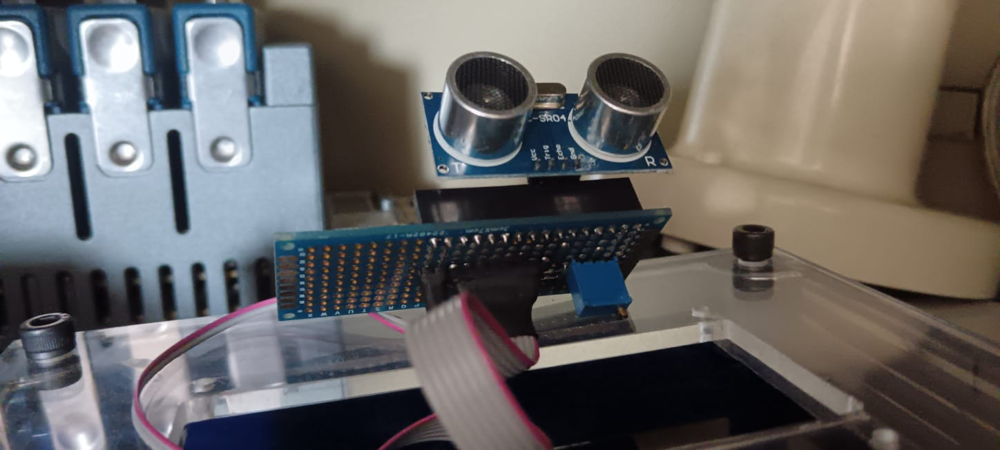
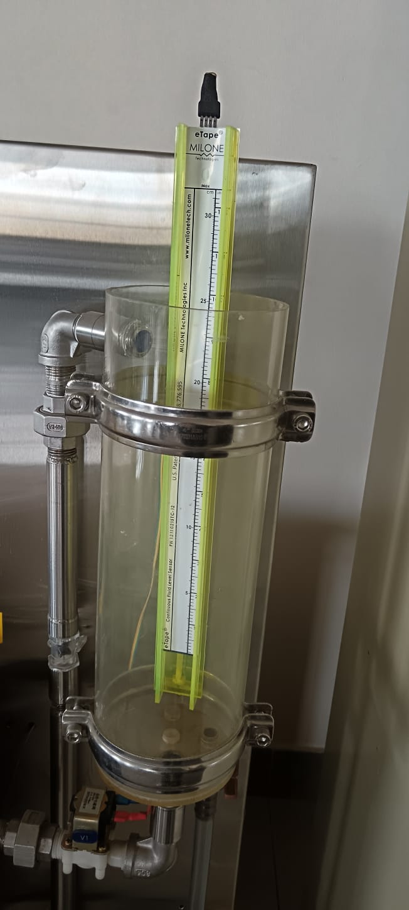

<h1 >
<i> Sensores Universidad Santo Tomás📓</i>
</h1>
  
 <b> Anemómetro 🍃</b> 

  

 Este dispositivo permite medir la velocidad del viento, esto por medio de las cazoletas que giran cuando sopla el viento. Se puede encontrar en el area de energias renovables.
 <h2> 

  <b> Sensor Ultrasónico Hc-SR04 📏</b> </h2>

  

 Este dispositivo permite medir la la distancia hacia cierto objeto, esto por medio de ondas sonoras que rebotan y por medio del tiempo que tardan en regresar se calcula la distancia. Se puede encontrar en el area de energias 
 <h2> 

 <b> Sensor Etape 💧 </b> </h2>

  

 Este dispositivo permite medir el nivel de liquido,este sensor cambia su resistencia en base a la altura del liquido que lo cubre. Se puede encontrar en el area de energias 
 <h3 >
<i> Autor: Camila Pérez Mercado</i>
</h3>

